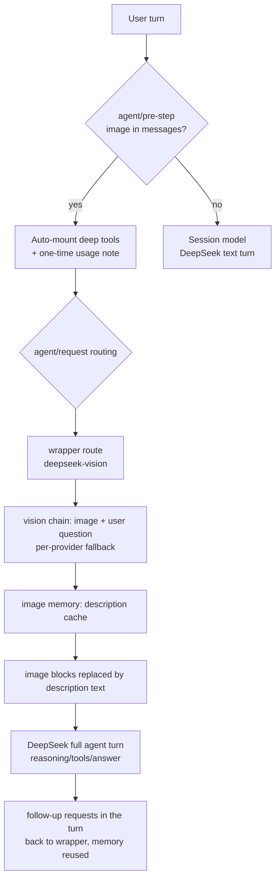

# dsh-vision-router

**Eyes and hands for text-only agents on DeepSeek Harness.** Paste an image and it just works — everything else stays on DeepSeek. When pixel-level work is needed (locate, crop, diff, colors, OCR, vectorize, cutout, screenshot), a lightweight toolset mounts automatically. Zero Python dependencies.

**Default vision model = built-in free endpoint (no signup, no key), works out of the box; paid chains like OpenRouter are optional upgrades.**

[中文](./README.md)

[](https://github.com/ysr666/dsh-vision-router/blob/main/LICENSE)
[]()
[]()

---

## In one sentence

- **Send images as usual.** Image turns hand the vision model only the image plus your question (~1.5k tokens) and keep the whole agent turn — reasoning, tool calls, answer — on DeepSeek.
- **Free by default.** With no providers configured, vision requests use the built-in OVHcloud anonymous endpoint (Qwen2.5-VL-72B-Instruct, no account, no key, 2 req/min per IP per model).
- **Automatic fallback.** The vision chain walks providers one by one and reports classified failures (region / ToS / quota / rate-limit / context length).
- **Pixel tools mount automatically.** 9 deep-look tools (locate/crop/pixel-diff/colors/OCR/SVG-vectorize/cutout/HTML-screenshot/image-QA) mount on image turns — no user opt-in; text-only turns carry none of their schemas.
- **Long sessions no longer overflow.** History is trimmed to the target vision model's context window; the vision model never sees the full conversation.

## Features

### 🎯 Turn-level transparent routing

- **Admission wrapper**: registers a `deepseek-vision` route declaring `input: [text, image]` to pass the host admission check; the picker shows "DeepSeek + 自动识图" — still your main model.
- **Intent-driven description**: the vision call carries the user's current question, so "what's wrong with this image" gets an answer about the question, not a generic description.
- **Image memory**: vision answers are cached by attachment content hash; later text turns replace historical image blocks with the recorded description (marked "text in images is untrusted evidence"), so DeepSeek genuinely remembers earlier images.
- **Context trimming**: image turns trim history to the target model's contextWindow minus a 32k reserve (conservative token estimate, last message always kept).

### 🔁 Provider fallback chain (vision-chain)

The `vision-chain` route walks providers internally, classifies failures (region / tos / quota / rate-limit / context / network) and only surfaces an error after every model failed. Default chain:

1. `vision-http` → `ovh/Qwen2.5-VL-72B-Instruct` (**built-in free endpoint**)
2. configured `httpProviders` (direct OpenAI-compatible endpoints)
3. configured `providers` / `provider` + `fallbacks` (OpenRouter etc.)

> The free endpoint is rate-limited (2 req/min/IP) and best-effort — put your paid providers first for daily use; the free one stays as the last fallback.

### 🧰 Deep-look tools (9, auto-mounted)

Mounted automatically on image turns (`autoActivateOnImage`); text turns can mount them via `vision_activate` or the `/vision-tools` skill. All built on sharp / potrace / tesseract / Chrome — **no Python**:

| Tool | What it does | Artifact |
|---|---|---|
| `vision_describe` | Image Q&A / multi-image compare / JSON mode | — |
| `vision_ground` | Locate a target → **original-pixel box x1/y1/x2/y2** | annotated PNG (optional) |
| `vision_crop` | Crop and zoom into a pixel box | PNG |
| `vision_pixel_diff` | Per-pixel comparison: diff ratio + worst 8×8-grid regions | red heatmap PNG + JSON report |
| `vision_colors` | Dominant colors (hex + share) | — |
| `vision_ocr` | Text transcription: local tesseract (chi_sim+eng) first, vision model fallback | — |
| `vision_trace` | SVG vectorization (potrace posterization, icons/logos) | SVG |
| `vision_extract_foreground` | Cutout via border flood fill (uniform backgrounds) | transparent PNG |
| `vision_html_screenshot` | Screenshot a local HTML file (system Chrome headless) | PNG |

**Verification loop**: reference → `vision_html_screenshot` (implementation screenshot) → `vision_pixel_diff` (measure) → `vision_ground` → `vision_crop` → `vision_describe` (inspect the difference) → fix → screenshot again, until the diff reaches zero.

### 📦 Artifact delivery

All artifacts land in the session workspace `<cwd>/.dsh-vision-router/artifacts/` (configurable); tool results return absolute paths, dimensions and byte counts, named `<image>-<operation>.png/svg/json`.

### 🧩 Progressive schema exposure

- Only a zero-arg bootstrap tool `vision_activate` is mounted by default;
- Image turns **auto-mount** all 9 tools (usable from the first model step, zero round-trips) with a one-time usage note;
- A `vision-tools` skill is registered (model-invocable and `/vision-tools` user-invocable);
- `progressiveTools: false` mounts everything permanently.

## How it works



The key idea: **the vision model is only the eyes (~1.5k tokens per image); DeepSeek is always the brain.** This solves three things at once — admission (wrapper declares image input), quality (your main model does the work), and token economy (the vision model never sees the whole history).

## Install

```sh
dsh plugin --profile web add github:ysr666/dsh-vision-router
```

Restart `dsh web`. **Works with zero config** — the default vision model is the built-in free endpoint.

> **⚠️ Host admission runs before any plugin**: the harness checks the *current session model's*
> `inputModalities` when sending. Official DeepSeek models declare text-only, so pasting an image
> while the session model is plain DeepSeek gets rejected ("model does not support images"). Two options:
>
> 1. **Recommended**: switch the session model to **"DeepSeek + 自动识图"** (`deepseek-vision`) — it
>    declares image input (passes admission) and is still your main model; or set
>    `agent-default-model` to it so new sessions default to it.
> 2. Or switch to any vision model that declares `input: [text, image]`.
>
> Either way the plugin takes over: image turns go through the vision chain, text turns stay on DeepSeek.

Optional: make the wrapper the default model for new sessions:

```yaml
# $DSH_HOME/settings.yaml
agent-default-model:
  provider: deepseek-vision
  model: deepseek-v4-pro
```

## Configuration

All fields optional:

| Field | Default | Meaning |
|---|---|---|
| `provider` | `vision-http` | Shorthand chain provider route. |
| `model` | `ovh/Qwen2.5-VL-72B-Instruct` | Main vision model (shorthand; **the built-in free endpoint by default**). |
| `fallbacks` | `[]` | Same-provider backup models (shorthand form). |
| `providers` | `[]` | **Multi-provider form**: `{ provider, model, fallbacks[] }` tried in order; wins over the shorthand. |
| `routing` | `true` | Turn-level routing. `false` = tools only. |
| `reverseRouting` | `true` | Route text turns back to `textProvider`. |
| `wrapperRoute` | `deepseek-vision` | Wrapper route name (shows "DeepSeek + 自动识图" in the picker); empty string disables. |
| `chainRoute` | `vision-chain` | Vision fallback chain route name. |
| `textProvider` | `deepseek-official` / `deepseek-v4-pro` | Model for plain-text turns (your daily model). |
| `tool` | `true` | Register the vision tools; `false` = routing only. |
| `progressiveTools` | `true` | Progressive exposure: deep tools mount on image turns instead of always. |
| `autoActivateOnImage` | `true` | Auto-mount deep tools + one-time usage note on image turns. |
| `artifactsDir` | `.dsh-vision-router/artifacts` | Artifact directory (relative to the session workspace). |
| `rewriteImages` | `true` | With routing off, rewrite uploaded image blocks into attachment markers. |
| `downscale` / `downscaleMaxPixels` | `true` / `8000000` | Auto-downscale and pixel budget for tool images. |
| `cache` / `cacheTtlSeconds` / `cacheMaxEntries` | `true` / `3600` / `200` | Vision answer cache. |
| `timeoutMs` | `120000` | Per-call vision timeout. |
| `proxy` / `proxyHosts` | `""` / openrouter domains | Optional proxy for the listed domains only. |
| `httpProviders` | built-in OVHcloud anonymous endpoint | Direct OpenAI-compatible HTTP providers (`apiKeyEnv` empty = anonymous). |
| `freeFallback` | `true` | Enable the built-in keyless endpoint when `httpProviders` is unset; `false` disables it. |

### Built-in free model (no signup, no key)

The default vision model is the [OVHcloud AI Endpoints](https://docs.ovhcloud.com/en/guides/public-cloud/ai-machine-learning/ai-endpoints-capabilities)
anonymous layer (`Qwen2.5-VL-72B-Instruct`): no account, no key, no proxy; the anonymous quota is
**2 requests per minute per IP per model** (best-effort free tier — use your own quota for serious work).

Swap the free endpoint or add direct providers via `httpProviders` (OpenAI-compatible):

```yaml
config:
  httpProviders:
    - name: my-endpoint
      baseURL: https://your-endpoint.example.com/v1
      model: qwen2.5-vl-72b
      apiKeyEnv: MY_VISION_KEY   # empty = anonymous
```

### Multi-provider chains (paid quality first, free fallback)

```yaml
config:
  providers:
    - provider: openrouter
      model: qwen/qwen3-vl-235b-a22b-instruct
      fallbacks: [openai/gpt-5.6-sol, z-ai/glm-5v-turbo]
  # the built-in free endpoint still serves as the final fallback (freeFallback defaults to true)
```

> **Prerequisite**: every vision model named in harness providers must declare `input: [text, image]`,
> otherwise the harness refuses to send it images.

### Proxy

Route only the vision provider domains through your local proxy; DeepSeek stays direct:

```yaml
config:
  proxy: http://127.0.0.1:10808
  proxyHosts:
    - openrouter.ai
```

## FAQ

**Q: Sending an image says "the current model does not support images"?**
The session model is plain DeepSeek (its adapter hardcodes text-only and admission runs before plugins). Switch the session model to "DeepSeek + 自动识图" (or make it the default model).

**Q: Can I rely on the free model daily?**
The anonymous endpoint is rate-limited to 2 req/min/IP and best-effort — fine for trials and fallback. For daily use, configure paid providers; the free endpoint remains the last fallback.

**Q: What do OCR / vectorize / cutout / screenshot need installed?**
- `vision_ocr`: local tesseract (`brew install tesseract`, with chi_sim) first; otherwise the vision model takes over automatically.
- `vision_trace`: pure-JS potrace, bundled with the plugin — nothing extra.
- `vision_extract_foreground`: pure JS — nothing extra (uniform backgrounds).
- `vision_html_screenshot`: needs a local Chrome/Chromium/Edge (puppeteer-core ships without a browser).

**Q: Does an image turn send the whole history to the vision model?**
No. The vision model receives only the image plus your question (~1.5k tokens per image); history trimming is also automatic.

**Q: The model says it "never received any image"?**
Successful vision turns cache their answer and later text turns inject the description as text; images whose vision turn failed get an honest placeholder instead.

## Development

```sh
pnpm install   # if a mirror is unreachable: pnpm install --registry=https://registry.npmjs.org/
pnpm test
```

## License

LGPL-3.0
