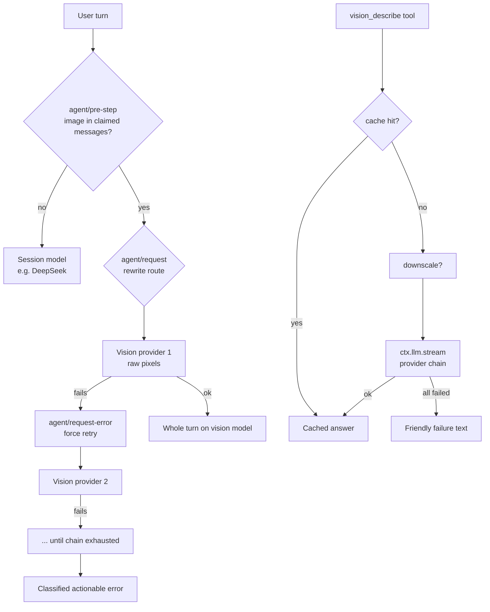

# dsh-vision-router

**Eyes for text-only agents on DeepSeek Harness.** Route image turns to a vision model — keep DeepSeek for everything else.

**Built-in free vision fallback (no signup, no key), fully customizable multi-provider chains; one config line, works out of the box.**

[中文](./README.md)

[](https://github.com/ysr666/dsh-vision-router/blob/main/LICENSE)
[]()
[]()
[](https://github.com/ysr666/dsh-vision-router/actions/workflows/ci.yml)
[]()

---

## In one sentence each

- Want to send images to DeepSeek? **Install this and keep working.** The turn with an image
  automatically runs on a vision model with raw pixels, then switches back — text turns stay
  DeepSeek at no extra cost.
- A vision model fails? **The next one is tried automatically**, and total failure tells you
  exactly why (region / ToS / quota / rate limit).
- Configured nothing? **Fine** — the built-in OVHcloud vision endpoint requires
  **no account and no key** (anonymous quota: 2 requests/min per IP per model) and backs
  `vision_describe` out of the box.

## Why dsh-vision-router

[DeepSeek Harness](https://github.com/deepseek-ai/deepseek-harness) is *everything-is-a-plugin*:
capabilities are Cordis rows, models route per request, and tools live in a shared registry.
This plugin is built **on those exact seams** instead of working around them:

| dsh capability | how this plugin rides it |
|---|---|
| Agent-loop waterfalls | `agent/pre-step` sees the turn's messages; `agent/request` rewrites the model route; `agent/request-error` drives fallbacks |
| Tool registry | `vision_describe` registers like any first-party tool — every preset gets it automatically |
| Sandbox & attachment services | file reads go through `ctx.fs` (sandbox-aware); images persist through `ctx.attachments` (content-addressed) |
| Plugin composition | one `insert` row in your profile patch; no preset edits, no source changes |

The result is **not** a text-description bridge (information loss), **not** a session-wide model
swap (bills every turn), but *turn-level routing*: the exact turn that contains an image gets
raw pixel access on a vision model; every other turn stays on your daily model.

## Features

<table>
<tr>
<td width="50%">

### 🎯 Turn-level routing
An image in the turn — from a drag-and-drop upload or a mid-turn `read_image` result —
switches the whole turn to the vision model. Text turns never leave DeepSeek.

</td>
<td width="50%">

### 🔁 Provider fallback chains
Region blocks, provider ToS refusals, 402 quota, 429 rate limits, network errors —
each failure walks to the next model automatically, even for error codes the default
retry policy would abort on.

</td>
</tr>
<tr>
<td width="50%">

### 🔍 vision_describe tool
Convert 1–4 images (local files or uploaded attachments) into a text answer on demand.
Supports side-by-side comparison — design mock vs. implementation screenshot.

</td>
<td width="50%">

### 🧾 JSON mode
Ask for structured output; invalid JSON is detected and retried once with a stricter
prompt before falling back.

</td>
</tr>
<tr>
<td width="50%">

### 🖼️ Image downscaling
Oversized images are downscaled with `sharp` before submission, instead of failing
the harness admission limits.

</td>
<td width="50%">

### 💾 Result caching
Answers are cached by content-addressed image id + question + model chain (LRU + TTL).
The same screenshot asked twice costs nothing.

</td>
</tr>
<tr>
<td width="50%">

### 🔌 Per-host proxy
Route only the vision provider's hosts through a local proxy (`http://` or `socks://`);
DeepSeek and everything else stay direct.

</td>
<td width="50%">

### 📎 Uploaded-attachment reuse
With routing disabled, uploaded images are rewritten into attachment markers, so the
text model can re-examine them later via `vision_describe`.

</td>
</tr>
</table>

## Architecture



## Installation

```sh
# from GitHub (this repository)
dsh plugin --profile web add github:ysr666/dsh-vision-router

# or, once published to npm:
# dsh plugin --profile web add dsh-vision-router
```

Add the row to your profile patch (`$DSH_HOME/profiles/web/cordis.patch.yml`):

```yaml
- insert:
    - id: vision-router
      name: 'dsh-vision-router'
      config:
        provider: openrouter
        # default primary model (paid, direct-connectable from China); with no
        # config at all, vision_describe still works on the built-in free endpoint
        model: qwen/qwen3-vl-235b-a22b-instruct
        fallbacks:
          - openai/gpt-5.6-sol
```

Restart `dsh web`.

> **Prerequisite**: every vision model you name must exist in your OpenRouter
> settings (`$DSH_HOME/settings.yaml` → `llm-pi-ai.providers.openrouter.models`)
> with `input: [text, image]`, otherwise the harness rejects image content for it.

## Configuration

| Field | Default | Meaning |
|---|---|---|
| `provider` | `openrouter` | Provider route for the shorthand chain. |
| `model` | `qwen/qwen3-vl-235b-a22b-instruct` | Primary vision model (shorthand; paid, China-direct friendly). |
| `fallbacks` | `[]` | Fallback models of the same provider (shorthand). |
| `providers` | `[]` | **Multi-provider form**: list of `{ provider, model, fallbacks[] }`; each entry is tried in order. Takes precedence over the shorthand. |
| `routing` | `true` | Turn-level routing. `false` = tool only. |
| `tool` | `true` | Register `vision_describe`. `false` = routing only. |
| `rewriteImages` | `true` | With routing disabled, rewrite uploaded image blocks into attachment markers. |
| `downscale` | `true` | Downscale images above `downscaleMaxPixels`. |
| `downscaleMaxPixels` | `8000000` | Pixel budget (≈8 MP) for tool images. |
| `cache` | `true` | Cache `vision_describe` answers. |
| `cacheTtlSeconds` | `3600` | Cache lifetime (`0` = forever). |
| `cacheMaxEntries` | `200` | LRU capacity. |
| `timeoutMs` | `120000` | Per vision call timeout (tool path). |
| `proxy` | `""` | Optional `http://host:port` or `socks://host:port`. |
| `proxyHosts` | `api.openrouter.ai`, `openrouter.ai` | Only these hosts go through `proxy`. |
| `httpProviders` | built-in OVHcloud anonymous endpoint | Direct-HTTP provider list (bypasses the harness llm service); empty = built-in free model below. |

### Built-in free model (no signup, no key)

When every configured model fails, `vision_describe` falls back to a **built-in free vision
endpoint** — the anonymous tier of [OVHcloud AI Endpoints](https://docs.ovhcloud.com/en/guides/public-cloud/ai-machine-learning/ai-endpoints-capabilities)
(`Qwen2.5-VL-72B-Instruct`): **no account and no key required, no proxy needed**; the
anonymous quota is **2 requests per minute per IP per model** (best-effort free tier). Override with `httpProviders` (OpenAI-compatible;
leave `apiKeyEnv` empty for anonymous):

```yaml
config:
  httpProviders:
    - name: ovh
      baseURL: https://oai.endpoints.kepler.ai.cloud.ovh.net/v1
      model: Qwen2.5-VL-72B-Instruct
    - name: zhipu
      baseURL: https://open.bigmodel.cn/api/paas/v4
      model: glm-4.6v-flash
      apiKeyEnv: ZAI_API_KEY
```

Other free tiers (key required; the OVHcloud anonymous tier above is currently the only
verified keyless vision API):

| Platform | Free vision models | China-direct | Notes |
|---|---|---|---|
| 🥇 Alibaba DashScope | `qwen-vl-plus` etc. | ✅ | 1M tokens/series/90 days for new users |
| 🥈 Zhipu bigmodel.cn | `glm-4.6v-flash` | ✅ | **permanently free** |
| 🥉 SiliconFlow | `Qwen/Qwen2.5-VL-7B-Instruct` etc. | ✅ | ¥14 credit covers it |
| OpenRouter (overseas) | `google/gemma-4-31b-it:free` etc. | proxy | 50 req/day; **free roster rotates often** |

Ready-to-merge settings snippets for each platform live in [`presets/`](./presets/); the full
survey with sources is [`docs/free-models.zh-CN.md`](./docs/free-models.zh-CN.md).

### Multi-provider chains

```yaml
config:
  providers:
    - provider: openrouter
      model: openai/gpt-5.6-sol
      fallbacks: [openai/gpt-5.6-sol-pro]
    - provider: openrouter
      model: qwen/qwen3-vl-235b-a22b-instruct
    - provider: pi-ai-custom
      model: glm-4.6v
```

Each provider/model pair is an independent link in the chain — a failure on one
moves to the next, regardless of provider.

### Proxy

```yaml
config:
  proxy: http://127.0.0.1:10808
  proxyHosts: [openrouter.ai]
```

Useful when the provider region-blocks your IP or your exit node is ToS-flagged.
Only the listed hosts are proxied; DeepSeek stays on the direct connection.

## Comparison

| | Manual model switching | MCP vision bridge | dsh-vision-router |
|---|---|---|---|
| Pixel fidelity | ✅ full (when switched) | ❌ text description only | ✅ full, on the image turn |
| Automatic | ❌ | ✅ | ✅ |
| Daily model untouched | ❌ (whole session swapped) | ✅ | ✅ |
| Provider failure recovery | ❌ | ❌ | ✅ fallback chains |
| Reusable structured queries | — | partial | ✅ JSON mode + caching |
| Free out-of-the-box | ❌ | ❌ | ✅ built-in keyless endpoint |
| Fits dsh composition | — | external server | ✅ one plugin row |

**Difference from existing dsh community projects** (all excellent, different focus):
[dsh-vision-sidecar](https://github.com/121103qwq/dsh-vision-sidecar) pre-describes images into
session messages (description bridge) with the OVHcloud anonymous default;
[dsh-vision-proxy](https://github.com/Flyvhidbwo/dsh-vision-proxy) wraps a provider route and
transcribes images in the request stream; [dsh-vision-provider](https://github.com/libinyam/dsh-vision-provider)
is a config-only multimodal route bundle; [modlens](https://github.com/liustack/modlens) reuses
local Codex/OpenCode/Pi logins as vision engines; [dsh-vision-toolkit](https://github.com/Anionex/dsh-vision-toolkit)
ships ten intent-aware visual tools; [dsh-tool-vision](https://github.com/Scorp1o117/dsh-tool-vision)
provides an `inspect_image` tool plus an `llm/stream` bridge. This plugin instead routes the
image turn to a vision model for raw-pixel access, adds fallback chains, caching, JSON mode,
downscaling, per-host proxy, and the built-in keyless free endpoint.

## Acknowledgements

This project borrows ideas from all of the above — especially the keyless free-endpoint
discovery (OVHcloud AI Endpoints anonymous tier) by
[dsh-vision-sidecar](https://github.com/121103qwq/dsh-vision-sidecar). Thanks to the authors of
[dsh-vision-proxy](https://github.com/Flyvhidbwo/dsh-vision-proxy),
[dsh-vision-provider](https://github.com/libinyam/dsh-vision-provider),
[modlens](https://github.com/liustack/modlens),
[dsh-vision-toolkit](https://github.com/Anionex/dsh-vision-toolkit), and
[dsh-tool-vision](https://github.com/Scorp1o117/dsh-tool-vision).

## FAQ

**Why turn-level instead of session-sticky routing?**
You wanted "everything except images on my daily model". The image turn gets full
pixel fidelity; the vision model's text conclusions stay in history for the text
model to read afterwards.

**Why 403 "not available in your region"?**
The provider enforces region availability. Route the provider hosts through a proxy
with an allowed exit IP, or use a region-available fallback model.

**Why "provider Terms Of Service" even through my proxy?**
Your exit node's IP is flagged by the provider (common for datacenter IPs). Switch
to a cleaner node, or use a fallback model.

**Why does `api.openrouter.ai` fail while `openrouter.ai` works?**
Some regions and exit nodes reset the `api.` subdomain specifically. Point your
OpenRouter `baseURL` at `https://openrouter.ai/api/v1` in your provider settings.

**Which image formats work?**
The harness attachment path accepts `png`/`jpeg`/`webp`/`gif` only. Convert
`heic`/`tiff` first. Uploaded images are limited by the deployment's
`attachment-local` limits (default 5 MB / 40 MP; override that row to raise them).

## Development

```sh
pnpm install
pnpm test
```

The exported helpers (`providersOf`, `blocksHaveImage`, `eventHasImage`,
`rewriteImageBlocks`, `extractJson`, `createCache`, `downscaleImage`,
`createChunkAssembler`, `classifyFailure`) are the testable core; `apply` wires
them into the harness waterfalls. Pull requests welcome.

## License

[LGPL-3.0](./LICENSE)
