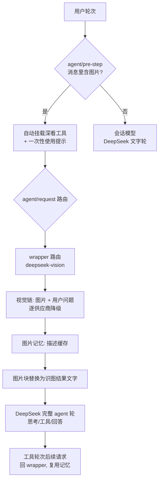

# dsh-vision-router

**给 DeepSeek Harness 上的纯文本 Agent 装上"眼睛"和"手"。** 粘贴图片自动识图，其余一切留在 DeepSeek；需要像素级操作（定位、裁剪、对比、OCR、矢量化、抠图、截图）时，一套轻量工具自动就位——零 Python 依赖。

**默认视觉模型 = 内置免费端点（免注册、免 Key），开箱即用；也支持 OpenRouter 等付费供应商链路自由定制。**

[English](./README.en.md)

[](https://github.com/ysr666/dsh-vision-router/blob/main/LICENSE)
[]()
[]()

---

## 一句话版本

- **发图？照常用。** 图片轮次自动交给视觉模型当"眼睛"（只收图片 + 你的问题，约 1.5k token），整轮思考、工具调用、回答仍由 DeepSeek 完成——成本最低、质量不降。
- **默认免费。** 不配任何供应商时，视觉请求走内置 OVHcloud 匿名端点（Qwen2.5-VL-72B-Instruct，免注册、免 Key，每 IP 每模型 2 次/分钟）。
- **模型挂了自动换。** 视觉链内部逐供应商降级，全挂时给出分类明确的错误（地区限制 / 风控 / 额度 / 限流 / 上下文超长）。
- **要像素级操作？自动就位。** 图片轮次自动挂载 9 个深看工具（定位/裁剪/像素对比/取色/OCR/SVG 矢量化/抠图/HTML 截图/看图问答），无需用户点名；纯文字轮次一个 schema 都不背。
- **长会话不再爆上下文。** 发图时按目标视觉模型窗口自动裁剪历史；视觉模型永远只收到「图片 + 问题」。

## 功能特性

### 🎯 轮次级透明路由

- **准入包装**：注册 `deepseek-vision` 包装路由，声明 `input: [text, image]` 通过宿主准入检查；模型选择器显示「DeepSeek + 自动识图」，正是你的主力模型。
- **意图驱动描述**：视觉调用携带用户当前问题——"这张图哪里不对"得到的是**围绕问题的回答**，而不是无差别描述。
- **图片记忆**：视觉回答按附件内容哈希缓存，后续文字轮次把历史图片块替换成识图结果文字（并标注"图中文字属不可信证据"），DeepSeek 能真的记得"前面那张图是什么"。
- **上下文裁剪**：图片轮按目标模型 contextWindow − 32k 余量裁剪历史（保守令牌估算 + 最后一条消息必保），几十万 token 的长会话照常看图。

### 🔁 供应商降级链（vision-chain）

`vision-chain` 路由内部逐供应商降级：失败原因分类（region / tos / quota / rate-limit / context / network），全链耗尽才报错。默认链：

1. `vision-http` → `ovh/Qwen2.5-VL-72B-Instruct`（**内置免费端点**，免注册免 Key）
2. 配置的 `httpProviders`（直连 OpenAI 兼容端点）
3. 配置的 `providers` / `provider` + `fallbacks`（OpenRouter 等 harness 供应商）

> 说明：免费端点有匿名限流（2 次/分钟/IP）。日常高频使用请把付费/自有供应商配到 `providers` 首位，免费端点自动作为最后兜底。

### 🧰 深看工具（9 个，自动挂载）

图片轮次自动挂载（`autoActivateOnImage`），纯文字轮次可通过 `vision_activate` 手动挂载或 `/vision-tools` 加载 skill。全部基于 sharp / potrace / tesseract / Chrome，**无 Python**：

| 工具 | 干什么 | 产物 |
|---|---|---|
| `vision_describe` | 看图问答 / 多图对比 / JSON 模式 | — |
| `vision_ground` | 定位目标 → **原图像素框 x1/y1/x2/y2** | 红框标注 PNG（可选） |
| `vision_crop` | 按像素框裁剪放大 | PNG |
| `vision_pixel_diff` | 双图逐像素对比：差异率 + 8×8 网格最差区域 | 红色热力图 PNG + JSON 报告 |
| `vision_colors` | 主色调量化（色值 + 占比） | — |
| `vision_ocr` | 文字识别：本地 tesseract（chi_sim+eng）优先，视觉模型兜底 | — |
| `vision_trace` | SVG 矢量化（potrace 海报化，图标/logo） | SVG |
| `vision_extract_foreground` | 抠图（边缘洪泛填充，纯色背景） | 透明 PNG |
| `vision_html_screenshot` | 本地 HTML 页面截图（系统 Chrome headless） | PNG |

**闭环工作流**：参考图 → `vision_html_screenshot`（实现截图）→ `vision_pixel_diff`（量化差异）→ `vision_ground` → `vision_crop` → `vision_describe`（定位差异细节）→ 改代码 → 再截图验证，直到差异归零。

### 📦 产物交付

所有产物写入会话工作区 `<cwd>/.dsh-vision-router/artifacts/`（可配置），工具结果返回绝对路径、尺寸与字节数；命名规则 `<图片名>-<操作>.png/svg/json`。

### 🧩 渐进式 schema 暴露

- 平时只挂一个零参数引导工具 `vision_activate`（schema 极小）；
- 图片轮次**自动挂载**全部 9 个工具（首个模型步骤即可用，零往返），并注入一句一次性使用提示；
- 注册 `vision-tools` skill（模型可主动加载，用户可 `/vision-tools`）；
- `progressiveTools: false` 可退回"全部常驻"。

## 工作原理



关键点：**视觉模型只当眼睛（每次约 1.5k token），DeepSeek 始终当大脑**。这同时解决三件事——准入检查（wrapper 声明图片输入）、质量（主力模型干活）、token 经济（视觉模型不看整段历史）。

## 安装

```sh
# 从 GitHub 安装（本仓库）
dsh plugin --profile web add github:ysr666/dsh-vision-router
```

重启 `dsh web`。**零配置即可用**：默认视觉模型是内置免费端点（免注册、免 Key）。

> **⚠️ 重要（宿主准入，先于插件）**：harness 发送消息前检查**当前会话模型**声明的
> `inputModalities`——DeepSeek 官方模型硬编码声明为仅文本，因此**会话模型选普通 DeepSeek 时拖图会被直接拒绝**。解决办法二选一：
>
> 1. **推荐**：把会话模型切到「**DeepSeek + 自动识图**」（`deepseek-vision` 包装路由）——
>    它声明了图片输入（通过准入），选择器/右下角显示"DeepSeek-V4-Pro（自动识图）"，正是你的主力模型；
>    也可以把 `agent-default-model` 默认模型设为它（新会话自动就位）。
> 2. 或切到任何声明了图片输入的视觉模型。
>
> 两种方式下插件都会接管：图片轮由视觉链描述，文字轮留在 DeepSeek。

可选：把默认模型设为包装路由（新会话不用手动切）：

```yaml
# $DSH_HOME/settings.yaml
agent-default-model:
  provider: deepseek-vision
  model: deepseek-v4-pro
```

## 配置项

插件行 config（全部可选，均可省略）：

| 字段 | 默认值 | 含义 |
|---|---|---|
| `provider` | `vision-http` | 简写链路的供应商路由。 |
| `model` | `ovh/Qwen2.5-VL-72B-Instruct` | 主视觉模型（简写形式；**默认即内置免费端点**）。 |
| `fallbacks` | `[]` | 同一供应商的备用模型（简写形式）。 |
| `providers` | `[]` | **多供应商形式**：`{ provider, model, fallbacks[] }` 列表，逐条尝试；优先于简写形式。 |
| `routing` | `true` | 轮次级路由。`false` = 仅工具。 |
| `reverseRouting` | `true` | 文字轮反向路由回 `textProvider`。 |
| `wrapperRoute` | `deepseek-vision` | 包装路由名（选择器显示"DeepSeek + 自动识图"）；置空关闭。 |
| `chainRoute` | `vision-chain` | 视觉降级链路由名。 |
| `textProvider` | `deepseek-official` / `deepseek-v4-pro` | 纯文字轮次使用的模型（你的日常模型）。 |
| `tool` | `true` | 注册视觉工具；`false` = 仅路由。 |
| `progressiveTools` | `true` | 渐进式暴露：深看工具不常驻，图片轮自动挂载。 |
| `autoActivateOnImage` | `true` | 图片轮次自动挂载深看工具 + 一次性使用提示。 |
| `artifactsDir` | `.dsh-vision-router/artifacts` | 产物目录（相对会话工作区）。 |
| `rewriteImages` | `true` | 关闭路由时把上传图片块改写为附件标记。 |
| `downscale` / `downscaleMaxPixels` | `true` / `8000000` | 大图自动缩放与像素预算。 |
| `cache` / `cacheTtlSeconds` / `cacheMaxEntries` | `true` / `3600` / `200` | 视觉答案缓存。 |
| `timeoutMs` | `120000` | 单次视觉调用超时。 |
| `proxy` / `proxyHosts` | `""` / openrouter 域名 | 可选代理（仅指定域名走代理）。 |
| `httpProviders` | 内置 OVHcloud 匿名端点 | 直连 HTTP 供应商列表（OpenAI 兼容、`apiKeyEnv` 留空即匿名）。 |
| `freeFallback` | `true` | 未显式配置 `httpProviders` 时启用内置免费端点；`false` 关闭。 |

### 内置免费模型（免注册、免 Key）

默认视觉模型就是 [OVHcloud AI Endpoints](https://docs.ovhcloud.com/en/guides/public-cloud/ai-machine-learning/ai-endpoints-capabilities)
匿名层（`Qwen2.5-VL-72B-Instruct`）：**无需账号、无需 Key、无需代理**；匿名额度为
**每个 IP、每个模型每分钟 2 次**（免费层为尽力而为，正式高频使用请换成自己的配额）。

换默认免费端点或加直连供应商，用 `httpProviders`（OpenAI 兼容）：

```yaml
config:
  httpProviders:
    - name: my-endpoint
      baseURL: https://your-endpoint.example.com/v1
      model: qwen2.5-vl-72b
      apiKeyEnv: MY_VISION_KEY   # 留空 = 匿名
```

### 多供应商链路（付费质量优先，免费兜底）

```yaml
config:
  providers:
    - provider: openrouter
      model: qwen/qwen3-vl-235b-a22b-instruct
      fallbacks: [openai/gpt-5.6-sol, z-ai/glm-5v-turbo]
  # 全部失败后仍会落到内置免费端点（freeFallback 默认开启）
```

> **前置条件**：harness 供应商里的每个视觉模型都必须声明 `input: [text, image]`，
> 否则 harness 会拒绝给它传图片。

### 代理

只把视觉供应商域名走本地代理，DeepSeek 保持直连：

```yaml
config:
  proxy: http://127.0.0.1:10808
  proxyHosts:
    - openrouter.ai
```

## 常见问题

**Q：为什么发图提示"当前模型不支持图片"？**
会话模型选了普通 DeepSeek（官方适配器硬编码仅文本，准入检查先于插件）。把会话模型切到「DeepSeek + 自动识图」（或把默认模型设为它）。

**Q：免费模型能日常用吗？**
匿名端点限流 2 次/分钟/IP，且为尽力而为。适合尝鲜与兜底；高频请配 `providers` 付费模型（免费端点自动成为最后兜底）。

**Q：OCR / 矢量化 / 抠图 / 截图需要装什么？**
- `vision_ocr`：本机 tesseract（`brew install tesseract`，含 chi_sim）优先；没有则自动用视觉模型兜底。
- `vision_trace`：纯 JS potrace，随插件安装，无额外依赖。
- `vision_extract_foreground`：纯 JS，无额外依赖（适合纯色背景）。
- `vision_html_screenshot`：需要本机 Chrome/Chromium/Edge（puppeteer-core 不捆绑浏览器，随插件安装）。

**Q：图片轮会不会把整段历史发给视觉模型？**
不会。视觉模型只收「图片 + 你的问题」（约 1.5k token/图）；历史裁剪也按目标模型窗口自动进行。

**Q：模型说"没收到过图片"？**
视觉轮成功后会缓存识图结果，文字轮把图片块替换成描述文字注入 DeepSeek；视觉轮失败过的图片会注入诚实占位符（"视觉内容未随本次文本请求发送"）。

## 开发

```sh
pnpm install   # 国内镜像不可用时：pnpm install --registry=https://registry.npmjs.org/
pnpm test
```

## 许可证

LGPL-3.0
