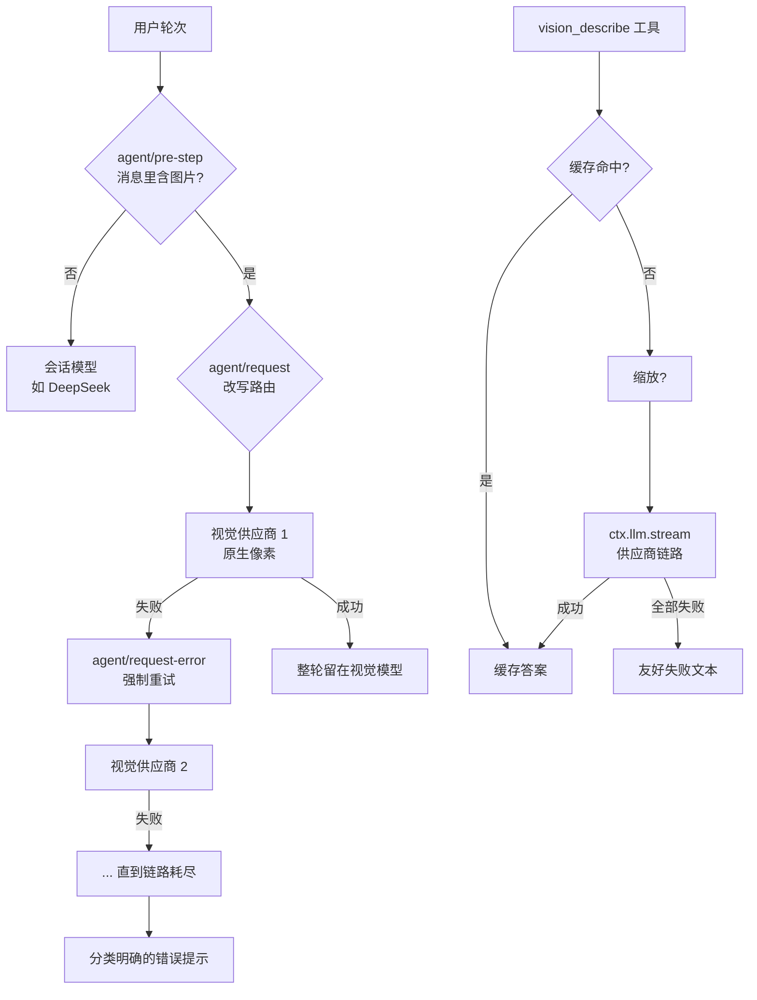

# dsh-vision-router

**给 DeepSeek Harness 上的纯文本 Agent 装上"眼睛"。** 图片轮次自动切视觉模型——其余一切留在 DeepSeek。

**内置免费视觉模型（免注册、免 Key），也支持多供应商链路自由定制；一行配置接入，开箱即用。**

[English](./README.en.md)

[](https://github.com/ysr666/dsh-vision-router/blob/main/LICENSE)
[]()
[]()
[](https://github.com/ysr666/dsh-vision-router/actions/workflows/ci.yml)
[]()

---

## 为什么是 dsh-vision-router

[DeepSeek Harness](https://github.com/deepseek-ai/deepseek-harness) 的理念是**一切皆插件**：
能力是 Cordis 行，模型按请求路由，工具共享一个注册表。本插件**正是建立在这些接缝之上**，
而不是绕过它们：

| dsh 的能力 | 本插件如何借力 |
|---|---|
| Agent-loop 瀑布 | `agent/pre-step` 看到轮次消息；`agent/request` 改写模型路由；`agent/request-error` 驱动降级 |
| 工具注册表 | `vision_describe` 像官方工具一样注册——所有预设自动获得 |
| 沙箱与附件服务 | 文件读取走 `ctx.fs`（沙箱感知）；图片经 `ctx.attachments` 持久化（内容寻址） |
| 插件组合 | profile 补丁里加一行 `insert`，不改预设、不动源码 |

因此它**不是**文字描述桥（有信息损耗），也**不是**整会话换模型（每轮都计费），
而是**轮次级路由**：恰好包含图片的那一轮在视觉模型上获得原生像素访问；
其余每一轮都留在你的日常模型上。

## 功能特性

<table>
<tr>
<td width="50%">

### 🎯 轮次级路由
轮次中出现图片——无论是拖拽上传还是中途 `read_image` 的结果——整轮切到视觉模型。
纯文字轮次永远留在 DeepSeek。

</td>
<td width="50%">

### 🔁 供应商降级链
地区限制、ToS 风控、402 额度不足、429 限流、网络错误——每种失败自动换下一个模型，
即使是默认重试策略会直接放弃的错误码。

</td>
</tr>
<tr>
<td width="50%">

### 🔍 vision_describe 工具
按需把 1–4 张图片（本地文件或会话上传附件）转成文字结论。
支持并排对比——设计稿 vs 实现截图。

</td>
<td width="50%">

### 🧾 JSON 模式
要求结构化输出；非法 JSON 会被检测，并用更严格的提示重试一次，再失败才回退。

</td>
</tr>
<tr>
<td width="50%">

### 🖼️ 大图自动缩放
超过阈值的图片用 `sharp` 自动缩放后再提交，而不是撞上 harness 的准入限制报错。

</td>
<td width="50%">

### 💾 结果缓存
答案按"内容寻址图片 id + 问题 + 模型链"缓存（LRU + TTL）。
同一张截图问两次，第二次零成本。

</td>
</tr>
<tr>
<td width="50%">

### 🔌 按域名代理
只把视觉供应商的域名走本地代理（`http://` 或 `socks://`）；
DeepSeek 与其他请求保持直连。

</td>
<td width="50%">

### 📎 上传附件复用
关闭路由时，上传图片会被改写为附件标记，文本模型之后仍可
通过 `vision_describe` 回看它们。

</td>
</tr>
</table>

## 工作原理



## 安装

```sh
# 从 GitHub 安装（本仓库）
dsh plugin --profile web add github:ysr666/dsh-vision-router

# 或 npm 发布后：
# dsh plugin --profile web add dsh-vision-router
```

在 profile 补丁（`$DSH_HOME/profiles/web/cordis.patch.yml`）中加一行：

```yaml
- insert:
    - id: vision-router
      name: 'dsh-vision-router'
      config:
        provider: openrouter
        model: openai/gpt-5.6-sol
        fallbacks:
          - qwen/qwen3-vl-235b-a22b-instruct
```

重启 `dsh web`。

> **前置条件**：你命名的每个视觉模型都必须存在于 OpenRouter 设置
> （`$DSH_HOME/settings.yaml` → `llm-pi-ai.providers.openrouter.models`）中，
> 并声明 `input: [text, image]`，否则 harness 会拒绝给它传图片。

## 配置项

| 字段 | 默认值 | 含义 |
|---|---|---|
| `provider` | `openrouter` | 简写链路的供应商路由。 |
| `model` | `openai/gpt-5.6-sol` | 主视觉模型（简写形式）。 |
| `fallbacks` | `[]` | 同一供应商的备用模型（简写形式）。 |
| `providers` | `[]` | **多供应商形式**：`{ provider, model, fallbacks[] }` 列表，逐条尝试；优先于简写形式。 |
| `routing` | `true` | 轮次级路由。`false` = 仅工具。 |
| `tool` | `true` | 注册 `vision_describe`。`false` = 仅路由。 |
| `rewriteImages` | `true` | 关闭路由时，把上传图片块改写为附件标记。 |
| `downscale` | `true` | 超过 `downscaleMaxPixels` 的图片自动缩放。 |
| `downscaleMaxPixels` | `8000000` | 工具图片的像素预算（约 8MP）。 |
| `cache` | `true` | 缓存 `vision_describe` 答案。 |
| `cacheTtlSeconds` | `3600` | 缓存有效期（`0` = 永久）。 |
| `cacheMaxEntries` | `200` | LRU 容量。 |
| `timeoutMs` | `120000` | 单次视觉调用超时（工具路径）。 |
| `proxy` | `""` | 可选 `http://host:port` 或 `socks://host:port`。 |
| `proxyHosts` | `api.openrouter.ai`、`openrouter.ai` | 仅这些域名走 `proxy`。 |
| `httpProviders` | 内置 OVHcloud 匿名端点 | 直连 HTTP 供应商列表（不走 harness llm 服务）；留空 = 用内置免费模型，见下文。 |

### 内置免费模型（免注册、免 Key）

`vision_describe` 在所有配置的付费/自有模型都失败后，会自动落到**内置的免费视觉端点**——
[OVHcloud AI Endpoints](https://docs.ovhcloud.com/en/guides/public-cloud/ai-machine-learning/ai-endpoints-capabilities)
的匿名层（`Qwen2.5-VL-72B-Instruct`）：**无需注册、无需 Key、无需代理**，
限额为每个 IP、每个模型每分钟 2 次（免费层为尽力而为，正式高频使用请换成自己的配额）。

想换掉默认免费端点或加更多直连供应商，用 `httpProviders`（OpenAI 兼容、`apiKeyEnv` 留空即匿名）：

```yaml
config:
  httpProviders:
    - name: ovh
      baseURL: https://oai.endpoints.kepler.ai.cloud.ovh.net/v1
      model: Qwen2.5-VL-72B-Instruct
    - name: zhipu
      baseURL: https://open.bigmodel.cn/api/paas/v4
      model: glm-4.6v-flash
      apiKeyEnv: ZAI_API_KEY
```

其他免费额度选择（均需注册领 Key，但中国大陆可直连）：阿里云百炼 `qwen-vl-plus`
（新用户 100 万 token/90 天）、智谱 `glm-4.6v-flash`（永久免费）、SiliconFlow 硅基流动
Qwen2.5-VL 系列；海外可选 OpenRouter 的 `google/gemma-4-31b-it:free` 等（免费额度会轮换，以官方为准）。

### 多供应商链路

```yaml
config:
  providers:
    - provider: openrouter
      model: openai/gpt-5.6-sol
      fallbacks: [openai/gpt-5.6-sol-pro]
    - provider: openrouter
      model: qwen/qwen3-vl-235b-a22b-instruct
    - provider: pi-ai-custom
      model: glm-4.6v
```

每个"供应商/模型"对都是链路中独立的一环——一环失败即换下一环，跨供应商同样生效。

### 代理

```yaml
config:
  proxy: http://127.0.0.1:10808
  proxyHosts: [openrouter.ai]
```

当供应商对你的 IP 做地区限制、或你的出口节点被 ToS 风控时非常有用。
只有列出的域名走代理；DeepSeek 保持直连。

## 方案对比

**一句话讲清区别**：其他 dsh 视觉插件大多"把图片转成文字描述再喂给 DeepSeek"（描述桥，有信息损耗）；
本插件主打"**图片轮直接交给视觉模型看原图**"（路由桥，像素保真），同时内置免 Key 免费模型兜底。

| | 手动切换模型 | MCP 视觉桥 | 本插件 |
|---|---|---|---|
| 像素保真 | ✅ 完整（切换后） | ❌ 只有文字描述 | ✅ 完整，图片轮内 |
| 自动化 | ❌ | ✅ | ✅ |
| 日常模型不受影响 | ❌（整会话被换） | ✅ | ✅ |
| 供应商失败恢复 | ❌ | ❌ | ✅ 降级链 |
| 可复用的结构化查询 | — | 部分 | ✅ JSON 模式 + 缓存 |
| 免费开箱即用 | ❌ | ❌ | ✅ 内置免 Key 免费端点 |
| 贴合 dsh 组合体系 | — | 外部服务器 | ✅ 一行插件行 |

**与现有 dsh 社区方案的差异**（均为优秀项目，各有侧重）：

| 项目 | 思路 | 本插件的差异 |
|---|---|---|
| [dsh-vision-sidecar](https://github.com/121103qwq/dsh-vision-sidecar) | 图片先经外部 VLM 做 OCR/描述，描述作为会话消息交给 DeepSeek；默认 OVHcloud 匿名端点 | 描述桥方案；本插件提供"原图直看"路由，描述能力由 `vision_describe` 按需替代 |
| [dsh-vision-proxy](https://github.com/Flyvhidbwo/dsh-vision-proxy) | 包装 provider 路由，请求流里把图片转译成文本再交给 DeepSeek | 转译桥方案；本插件不包装 provider，通过 `agent/request` 瀑布改写路由 |
| [dsh-vision-provider](https://github.com/libinyam/dsh-vision-provider) | 纯配置 bundle，注册一个 OpenAI 兼容多模态路由 | 配置层思路相同；本插件在此基础上增加自动路由、降级链与工具 |
| [modlens](https://github.com/liustack/modlens) | 最早的 dsh 视觉插件；复用本机 Codex/OpenCode/Pi 等登录态作为视觉引擎 | 引擎复用思路；本插件自带供应商链，不依赖本机其他 CLI |
| [dsh-vision-toolkit](https://github.com/Anionex/dsh-vision-toolkit) | 10 个意图化视觉工具（Q&A/OCR/像素校验/UI 还原） | 工具集更全；本插件聚焦"路由 + 一个通用对比工具"，更轻 |
| [dsh-tool-vision](https://github.com/Scorp1o117/dsh-tool-vision) | `inspect_image` 工具 + `llm/stream` 瀑布图片桥 | 瀑布桥思路相近；本插件多出轮次路由、降级链、缓存与免费端点 |

## 致谢

本插件借鉴了以上全部社区项目的思路，特别是 [dsh-vision-sidecar](https://github.com/121103qwq/dsh-vision-sidecar)
的"免注册免费端点"发现（OVHcloud AI Endpoints 匿名层）。感谢
[dsh-vision-proxy](https://github.com/Flyvhidbwo/dsh-vision-proxy)、
[dsh-vision-provider](https://github.com/libinyam/dsh-vision-provider)、
[modlens](https://github.com/liustack/modlens)、
[dsh-vision-toolkit](https://github.com/Anionex/dsh-vision-toolkit)、
[dsh-tool-vision](https://github.com/Scorp1o117/dsh-tool-vision) 作者们的探索。

## 常见问题

**为什么是轮次级而不是会话级粘性路由？**
你要的是"除了图片都走日常模型"。图片轮获得完整像素保真；视觉模型的文字结论
留在历史里，文本模型之后仍能读到。

**为什么 403 "not available in your region"？**
供应商按地区限制。把供应商域名走一个出口 IP 可用的代理，或用地区可用的备用模型。

**为什么走了代理还是 "provider Terms Of Service"？**
你的出口节点 IP 被供应商风控（数据中心 IP 很常见）。换个干净的节点，或用备用模型。

**为什么 `api.openrouter.ai` 连不上而 `openrouter.ai` 正常？**
部分地区和出口节点专门重置 `api.` 子域名。把 OpenRouter 的 `baseURL` 指向
`https://openrouter.ai/api/v1` 即可。

**支持哪些图片格式？**
harness 附件路径只接受 `png`/`jpeg`/`webp`/`gif`。`heic`/`tiff` 需先转码。
上传图片还受部署的 `attachment-local` 限制（默认 5 MB / 4000 万像素，
覆盖该行可调大）。

## 开发

```sh
pnpm install
pnpm test
```

导出的纯函数（`providersOf`、`blocksHaveImage`、`eventHasImage`、
`rewriteImageBlocks`、`extractJson`、`createCache`、`downscaleImage`、
`createChunkAssembler`、`classifyFailure`）是可测试的核心；`apply` 负责把
它们接入 harness 瀑布。欢迎 PR。

## 许可证

[LGPL-3.0](./LICENSE)
