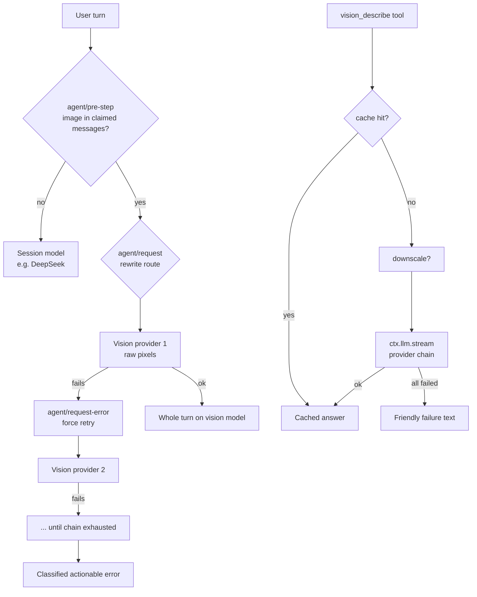

# dsh-vision-router

**Eyes for text-only agents on DeepSeek Harness.** Route image turns to a vision model — keep DeepSeek for everything else.

<p align="center">
  
  =20" src="https://img.shields.io/badge/Node-%3E%3D20-green.svg">
  
  
</p>

---

## Why dsh-vision-router

[DeepSeek Harness](https://github.com/deepseek-ai/deepseek-harness) is *everything-is-a-plugin*:
capabilities are Cordis rows, models route per request, and tools live in a shared registry.
This plugin is built **on those exact seams** instead of working around them:

| dsh capability | how this plugin rides it |
|---|---|
| Agent-loop waterfalls | `agent/pre-step` sees the turn's messages; `agent/request` rewrites the model route; `agent/request-error` drives fallbacks |
| Tool registry | `vision_describe` registers like any first-party tool — every preset gets it automatically |
| Sandbox & attachment services | file reads go through `ctx.fs` (sandbox-aware); images persist through `ctx.attachments` (content-addressed) |
| Plugin composition | one `insert` row in your profile patch; no preset edits, no source changes |

The result is **not** a text-description bridge (information loss), **not** a session-wide model
swap (bills every turn), but *turn-level routing*: the exact turn that contains an image gets
raw pixel access on a vision model; every other turn stays on your daily model.

## Features

<table>
<tr>
<td width="50%">

### 🎯 Turn-level routing
An image in the turn — from a drag-and-drop upload or a mid-turn `read_image` result —
switches the whole turn to the vision model. Text turns never leave DeepSeek.

</td>
<td width="50%">

### 🔁 Provider fallback chains
Region blocks, provider ToS refusals, 402 quota, 429 rate limits, network errors —
each failure walks to the next model automatically, even for error codes the default
retry policy would abort on.

</td>
</tr>
<tr>
<td width="50%">

### 🔍 vision_describe tool
Convert 1–4 images (local files or uploaded attachments) into a text answer on demand.
Supports side-by-side comparison — design mock vs. implementation screenshot.

</td>
<td width="50%">

### 🧾 JSON mode
Ask for structured output; invalid JSON is detected and retried once with a stricter
prompt before falling back.

</td>
</tr>
<tr>
<td width="50%">

### 🖼️ Image downscaling
Oversized images are downscaled with `sharp` before submission, instead of failing
the harness admission limits.

</td>
<td width="50%">

### 💾 Result caching
Answers are cached by content-addressed image id + question + model chain (LRU + TTL).
The same screenshot asked twice costs nothing.

</td>
</tr>
<tr>
<td width="50%">

### 🔌 Per-host proxy
Route only the vision provider's hosts through a local proxy (`http://` or `socks://`);
DeepSeek and everything else stay direct.

</td>
<td width="50%">

### 📎 Uploaded-attachment reuse
With routing disabled, uploaded images are rewritten into attachment markers, so the
text model can re-examine them later via `vision_describe`.

</td>
</tr>
</table>

## Architecture



## Installation

```sh
dsh plugin --profile web add dsh-vision-router
```

Add the row to your profile patch (`$DSH_HOME/profiles/web/cordis.patch.yml`):

```yaml
- insert:
    - id: vision-router
      name: 'dsh-vision-router'
      config:
        provider: openrouter
        model: openai/gpt-5.6-sol
        fallbacks:
          - qwen/qwen3-vl-235b-a22b-instruct
```

Restart `dsh web`.

> **Prerequisite**: every vision model you name must exist in your OpenRouter
> settings (`$DSH_HOME/settings.yaml` → `llm-pi-ai.providers.openrouter.models`)
> with `input: [text, image]`, otherwise the harness rejects image content for it.

## Configuration

| Field | Default | Meaning |
|---|---|---|
| `provider` | `openrouter` | Provider route for the shorthand chain. |
| `model` | `openai/gpt-5.6-sol` | Primary vision model (shorthand). |
| `fallbacks` | `[]` | Fallback models of the same provider (shorthand). |
| `providers` | `[]` | **Multi-provider form**: list of `{ provider, model, fallbacks[] }`; each entry is tried in order. Takes precedence over the shorthand. |
| `routing` | `true` | Turn-level routing. `false` = tool only. |
| `tool` | `true` | Register `vision_describe`. `false` = routing only. |
| `rewriteImages` | `true` | With routing disabled, rewrite uploaded image blocks into attachment markers. |
| `downscale` | `true` | Downscale images above `downscaleMaxPixels`. |
| `downscaleMaxPixels` | `8000000` | Pixel budget (≈8 MP) for tool images. |
| `cache` | `true` | Cache `vision_describe` answers. |
| `cacheTtlSeconds` | `3600` | Cache lifetime (`0` = forever). |
| `cacheMaxEntries` | `200` | LRU capacity. |
| `timeoutMs` | `120000` | Per vision call timeout (tool path). |
| `proxy` | `""` | Optional `http://host:port` or `socks://host:port`. |
| `proxyHosts` | `api.openrouter.ai`, `openrouter.ai` | Only these hosts go through `proxy`. |

### Multi-provider chains

```yaml
config:
  providers:
    - provider: openrouter
      model: openai/gpt-5.6-sol
      fallbacks: [openai/gpt-5.6-sol-pro]
    - provider: openrouter
      model: qwen/qwen3-vl-235b-a22b-instruct
    - provider: pi-ai-custom
      model: glm-4.6v
```

Each provider/model pair is an independent link in the chain — a failure on one
moves to the next, regardless of provider.

### Proxy

```yaml
config:
  proxy: http://127.0.0.1:10808
  proxyHosts: [openrouter.ai]
```

Useful when the provider region-blocks your IP or your exit node is ToS-flagged.
Only the listed hosts are proxied; DeepSeek stays on the direct connection.

## Comparison

| | Manual model switching | MCP vision bridge | dsh-vision-router |
|---|---|---|---|
| Pixel fidelity | ✅ full (when switched) | ❌ text description only | ✅ full, on the image turn |
| Automatic | ❌ | ✅ | ✅ |
| Daily model untouched | ❌ (whole session swapped) | ✅ | ✅ |
| Provider failure recovery | ❌ | ❌ | ✅ fallback chains |
| Reusable structured queries | — | partial | ✅ JSON mode + caching |
| Fits dsh composition | — | external server | ✅ one plugin row |

## FAQ

**Why turn-level instead of session-sticky routing?**
You wanted "everything except images on my daily model". The image turn gets full
pixel fidelity; the vision model's text conclusions stay in history for the text
model to read afterwards.

**Why 403 "not available in your region"?**
The provider enforces region availability. Route the provider hosts through a proxy
with an allowed exit IP, or use a region-available fallback model.

**Why "provider Terms Of Service" even through my proxy?**
Your exit node's IP is flagged by the provider (common for datacenter IPs). Switch
to a cleaner node, or use a fallback model.

**Why does `api.openrouter.ai` fail while `openrouter.ai` works?**
Some regions and exit nodes reset the `api.` subdomain specifically. Point your
OpenRouter `baseURL` at `https://openrouter.ai/api/v1` in your provider settings.

**Which image formats work?**
The harness attachment path accepts `png`/`jpeg`/`webp`/`gif` only. Convert
`heic`/`tiff` first. Uploaded images are limited by the deployment's
`attachment-local` limits (default 5 MB / 40 MP; override that row to raise them).

## Development

```sh
pnpm install
pnpm test
```

The exported helpers (`providersOf`, `blocksHaveImage`, `eventHasImage`,
`rewriteImageBlocks`, `extractJson`, `createCache`, `downscaleImage`,
`createChunkAssembler`, `classifyFailure`) are the testable core; `apply` wires
them into the harness waterfalls. Pull requests welcome.

## License

[LGPL-3.0](./LICENSE)

---

## 中文摘要

给纯文本会话模型（如 DeepSeek）装上"眼睛"的 DeepSeek Harness 插件，完全贴合 dsh
"一切皆插件"的设计：

- **轮次级路由**：包含图片的那一轮整轮走视觉模型（原生像素，无文字桥损耗），其余轮次留在 DeepSeek；
- **供应商降级链**：地区限制 / ToS 风控 / 402 额度 / 429 限流 / 网络错误自动换下一个模型（支持多供应商独立链路）；
- **`vision_describe` 工具**：本地文件与会话内上传附件均可查（1–4 张对比），支持 JSON 结构化输出与结果缓存（内容寻址去重）；
- **大图自动缩放**（sharp）、**按域名代理**（DeepSeek 保持直连）、错误分类与针对性建议。

安装：`dsh plugin --profile web add dsh-vision-router`，在 profile 补丁中加一行
`vision-router` 行，重启即可。图片格式仅 png/jpeg/webp/gif，视觉模型需在 OpenRouter
设置中声明 `input: [text, image]`。LGPL-3.0 许可。
